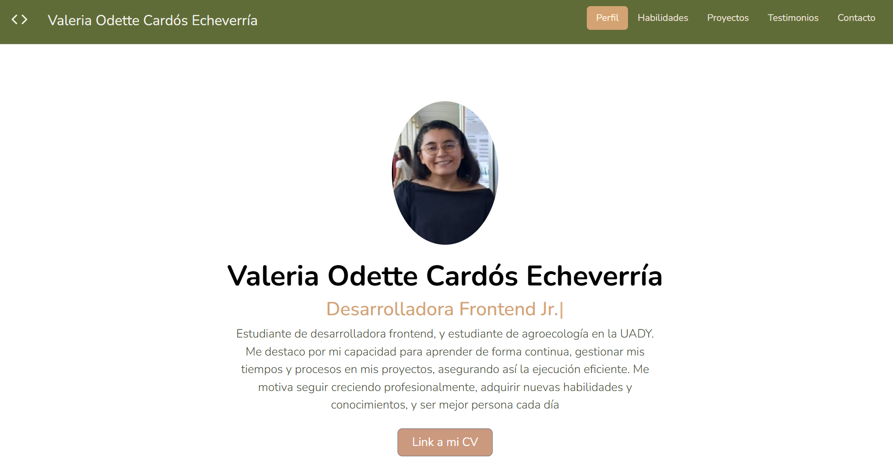
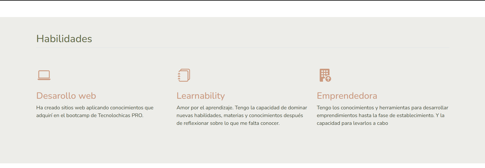
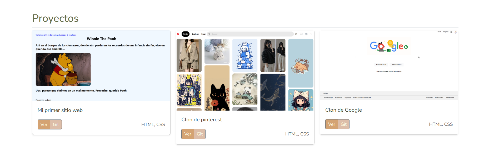
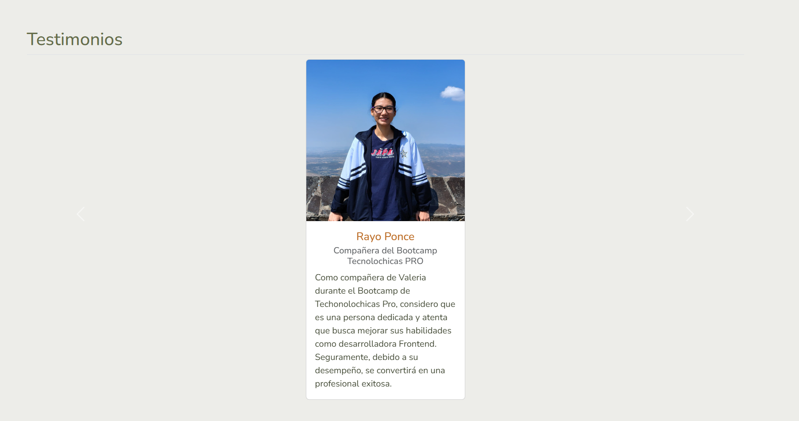
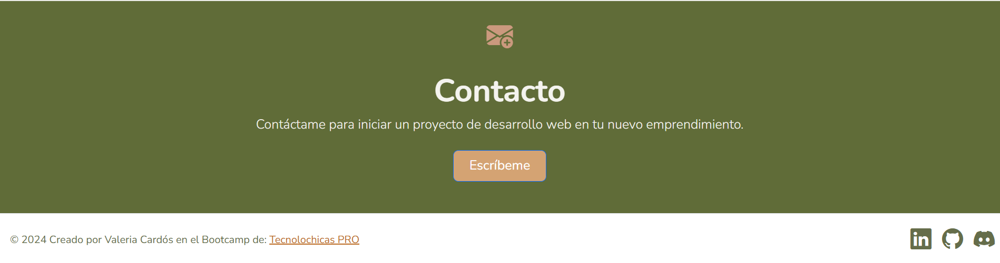

<!-- Los # indican el tamaño de la letra -->
# Portafolio de proyectos
<!-- *: cursiva, **: negritas, ***: cursivas y negritas -->
¡Hola! ***Soy Valeria Cardós Echeverría***. Soy desarrolladora web Jr. Me apasiona el aprendizaje en tecnología y agroecología, aquí encontrarás información sobre mi.
___
## El proyecto cuenta con las siguientes secciones

- 👩🏽 Perfil
- 💪🏽 Habilidades
- 📖 Proyectos
- 🫂 Testimonios
- 📧 Contacto

### Creado con:
- HTML
- CSS
- JAVASCRIPT

Listado de herramientas que utilizo:
    
    
    
    
### Vista previa

### *Espero saber de ti pronto c:*
*Correo*
[valeokr2e@gmail.com](mailto:valeokr2e@gmail.com)

### Creado en el Bootcamp de Tecnolochicas PRO III 2024 ❤️
[Tecnolochicas PRO](https://tecnolochicas.mx/)